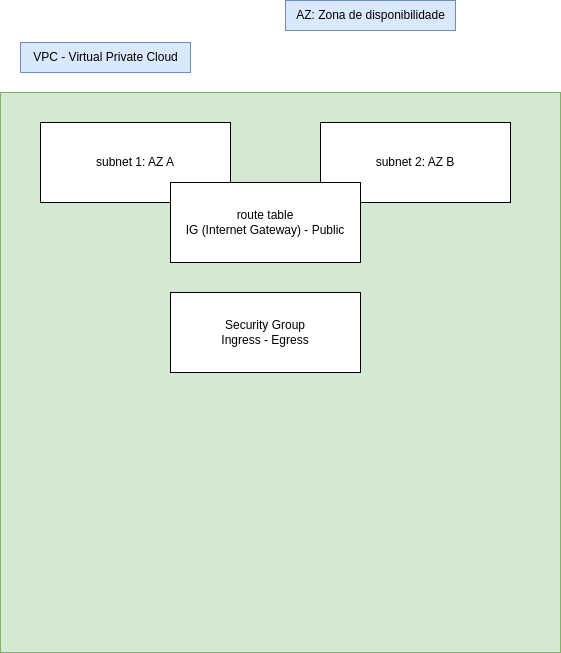

# Full Cycle 3

## IAC (Infrastructure As Code) - Terraform

Terraform é uma ferramenta de infraestrutura como código (IaC) criada pela HashiCorp. Ela permite que você defina e provisiona infraestrutura através de arquivos de configuração legíveis e versionáveis. Aqui estão alguns conceitos básicos para você começar:

1. Arquivos de Configuração
   Os arquivos de configuração do Terraform geralmente têm a extensão .tf e são usados para definir os recursos de infraestrutura. Estes arquivos são escritos em HashiCorp Configuration Language (HCL), que é uma linguagem declarativa.

2. Providers
   Os providers são responsáveis por entenderem como interagir com as APIs dos serviços que você quer gerenciar. Por exemplo, o provider aws permite que você gerencie recursos na Amazon Web Services (AWS).

Exemplo:

```hcl
provider "aws" {
  region = "us-west-2"
}
```

3. Resources

Os resources são os componentes básicos que compõem sua infraestrutura. Pode ser uma instância EC2, um bucket S3, ou qualquer outro recurso que o provider suporte.

Exemplo:

```hcl
resource "aws_instance" "example" {
  ami           = "ami-0c55b159cbfafe1f0"
  instance_type = "t2.micro"
}
```

4. Variables

As variables permitem que você parametrize sua configuração, tornando-a mais flexível e reutilizável. Elas são definidas usando a palavra-chave variable.

Exemplo:

```hcl
variable "instance_type" {
  default = "t2.micro"
}

resource "aws_instance" "example" {
  ami           = "ami-0c55b159cbfafe1f0"
  instance_type = var.instance_type
}
```

5. Outputs

Os outputs permitem que você exponha valores específicos de sua configuração para uso posterior, como IDs de instâncias ou endereços IP.

Exemplo:

```hcl
output "instance_id" {
  value = aws_instance.example.id
}
```

6. State

O Terraform mantém o controle do estado da sua infraestrutura em arquivos de estado (terraform.tfstate). Esse arquivo é essencial para o funcionamento do Terraform, pois ele rastreia os recursos gerenciados, permitindo que o Terraform saiba o que precisa ser criado, atualizado ou destruído.

7.  Comandos Básicos

- `terraform init`: Inicializa um novo ou existente diretório de configuração do Terraform, baixando os plugins necessários.

- `terraform plan`: Cria um plano de execução, mostrando o que o Terraform fará ao aplicar as configurações.

- `terraform apply`: Executa as ações propostas pelo terraform plan e cria ou modifica a infraestrutura.

- `terraform destroy`: Remove todos os recursos gerenciados pela configuração do Terraform.

Exemplo Completo de Configuração
Aqui está um exemplo completo que cria uma instância EC2 na AWS:

```hcl
provider "aws" {
  region = "us-west-2"
}

resource "aws_instance" "example" {
  ami           = "ami-0c55b159cbfafe1f0"
  instance_type = "t2.micro"
}

output "instance_id" {
  value = aws_instance.example.id
}
```

# Conceitos de VPC na AWS

<p align="center">
  <a href="">
    
  </a>
</p>
